# Vendor_Management_System

This project aims to develop a Vendor Management System (VMS) using Django and Django REST Framework. The system will facilitate the management of vendor profiles, tracking of purchase orders, and calculation of vendor performance metrics.
Installation

Create and activate a virtual environment:

``` 
python -m venv venv
.\venv\Scripts\activate
```
Install dependencies:
`` pip install -r requirements.txt``

Run migrations:
````
python manage.py makemigrations
python manage.py migrate
````

Run
``python manage.py runserver`` to start the server


## Features
### Vendor Profile Management:
APIEndpoints:
 ````
 ● POST/api/vendors/: Create a new vendor.
 ● GET/api/vendors/: List all vendors.
 ● GET/api/vendors/{vendor_id}/: Retrieve a specific vendor's details.
 ● PUT/api/vendors/{vendor_id}/: Update a vendor's details.
 ● DELETE/api/vendors/{vendor_id}/: Delete a vendor.
 ````

#### 1. ``POST/api/vendors/: Create a new vendor.``

Sample JSON for Creating a New Vendor
````
{
    "name": "Vendor2",
    "contact_details": "123-456-7890",
    "address": "1111 Main St, City",
    "vendor_code": "SAMPLE002"
}
````
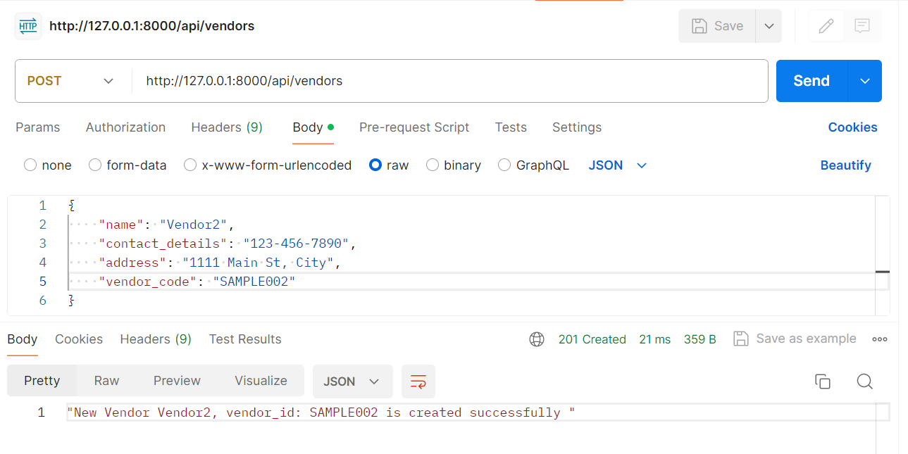
#### 2.  ``GET/api/vendors/: List all vendors.``
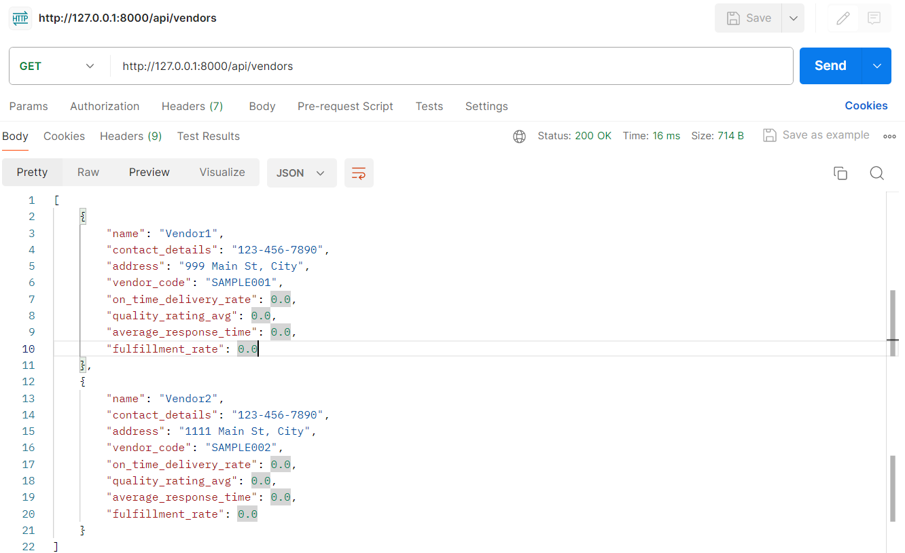

#### 3. ``GET/api/vendors/{vendor_id}/: Retrieve a specific vendor's details.``
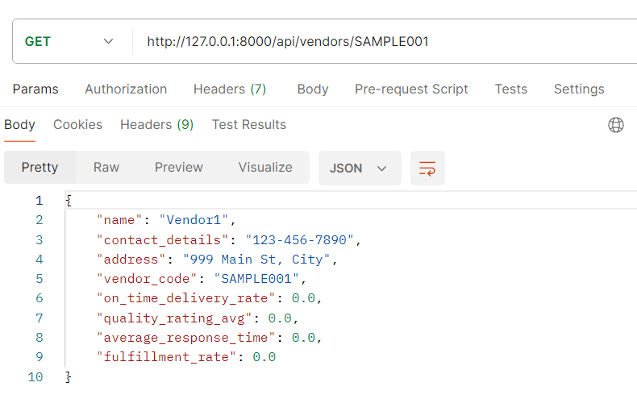


#### 4. ``PUT/api/vendors/{vendor_id}/: Update a vendor's details.``
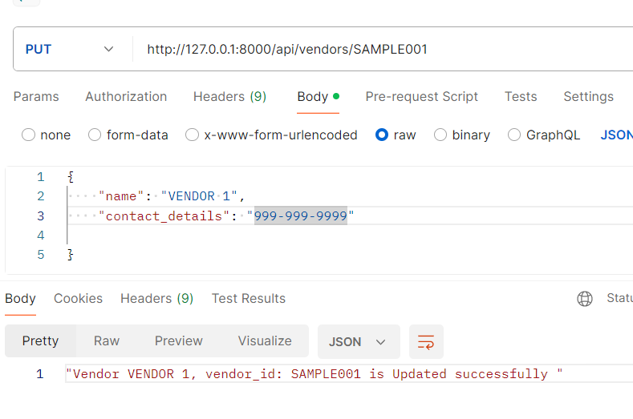


#### 5. ``DELETE/api/vendors/{vendor_id}/: Delete a vendor.``
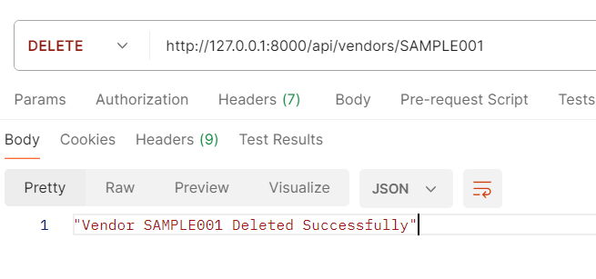


### Purchase Order Tracking:
APIEndpoints:
````
 ● POST/api/purchase_orders/: Create a purchase order.
 ● GET/api/purchase_orders/: List all purchase orders with an option to filter by
 vendor.
 ● GET/api/purchase_orders/{po_id}/: Retrieve details of a specific purchase order.
 ● PUT/api/purchase_orders/{po_id}/: Update a purchase order.
 ● DELETE/api/purchase_orders/{po_id}/: Delete a purchase order.
````

#### 1. ``POST/api/purchase_orders/: Create a purchase order.``
Sample JSON for Creating a Purchase Order
````
{
    "po_number": "PO002",
    "vendor": "SAMPLE002",
    "order_date": "2024-05-10T10:00:00",
    "delivery_date": "2024-06-20T10:00:00",
    "items": [{"name": "Item1", "quantity": 5},{"name": "Item2", "quantity": 10}],
    "quantity": 10,
    "status": "pending"
}
````
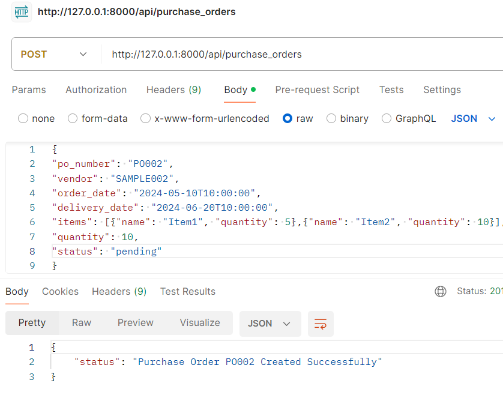

#### 2 ``GET/api/purchase_orders/: List all purchase orders with an option to filter by  vendor``
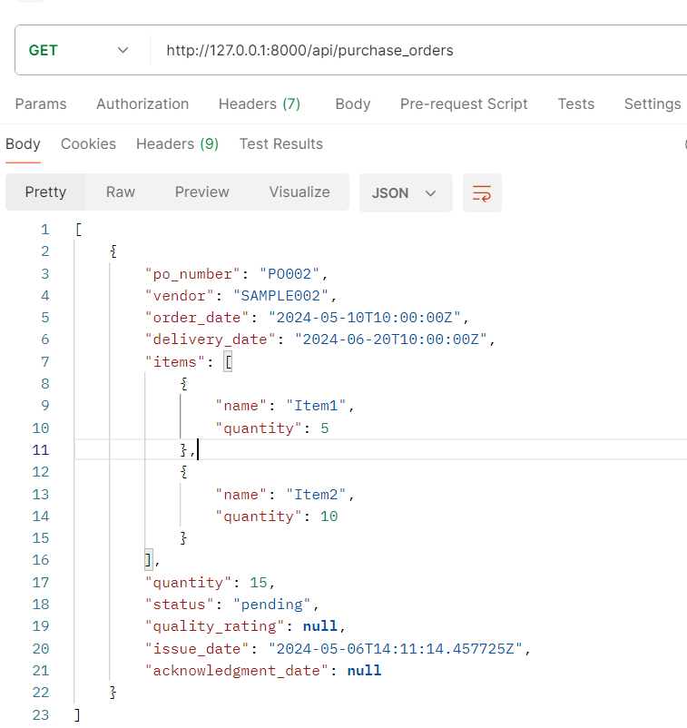


#### 3 ``GET/api/purchase_orders/{po_id}/: Retrieve details of a specific purchase order.``
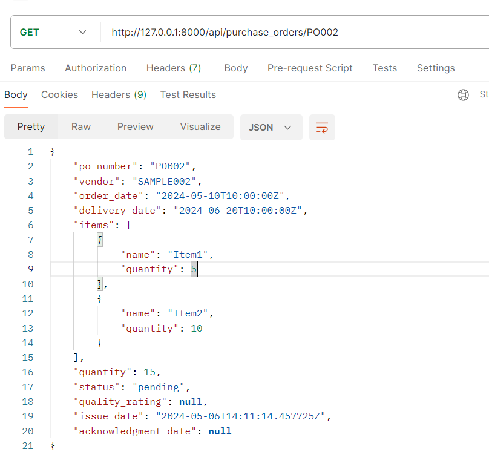

#### 4 ``PUT/api/purchase_orders/{po_id}/: Update a purchase order``

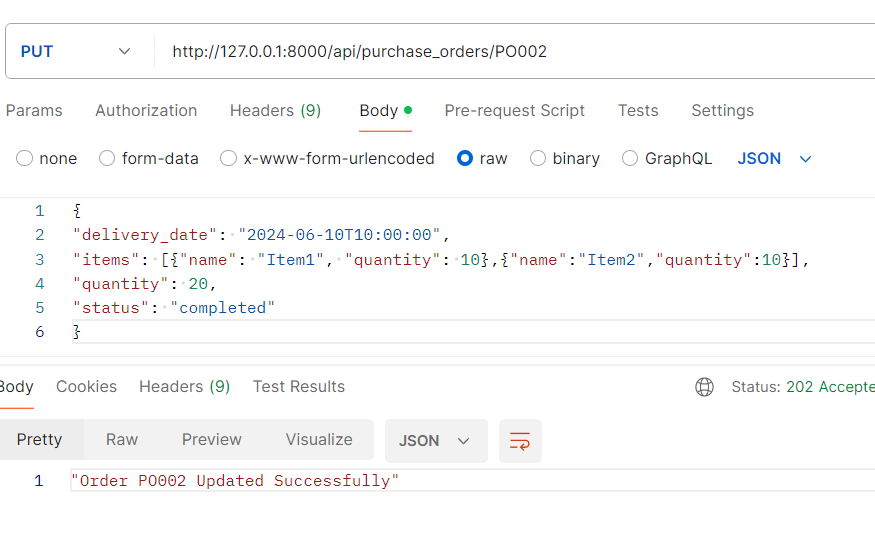

Note: In this Vendor Management System, the performance metrics for vendors are recalculated whenever the status of a purchase order changes. This dynamic update ensures that metrics such as on-time delivery rate, quality rating average, average response time, and fulfillment rate are always up-to-date based on the latest data. 
This approach to recalculating metrics ensures that our performance evaluations are accurate and reflect the current status of vendor performance.
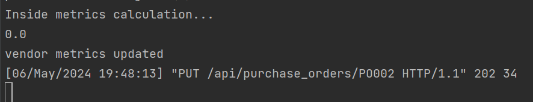

#### 5 ``DELETE/api/purchase_orders/{po_id}/: Delete a purchase order.``
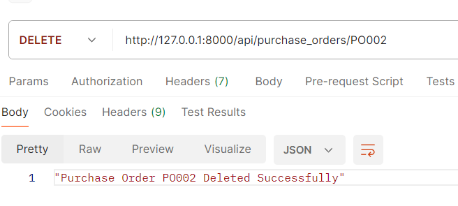

#### 6 ``POST/api/purchase_orders/{po_id}/acknowledge : Update Acknowledgement Date``
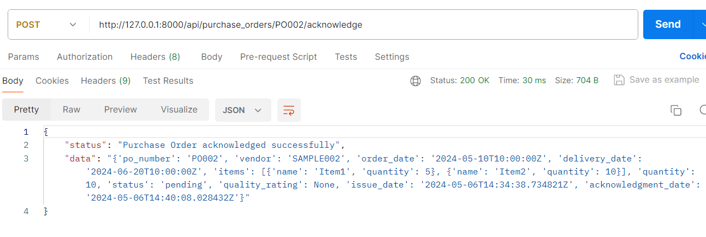

### Vendor Performance Evaluation
````
 APIEndpoints:
 ● GET/api/vendors/{vendor_id}/performance: Retrieve a vendor's performance
 metrics
````

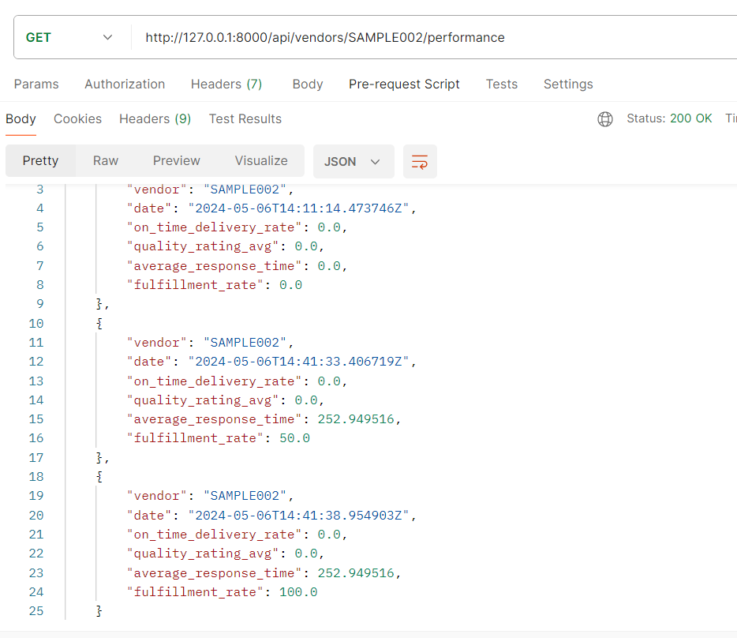
